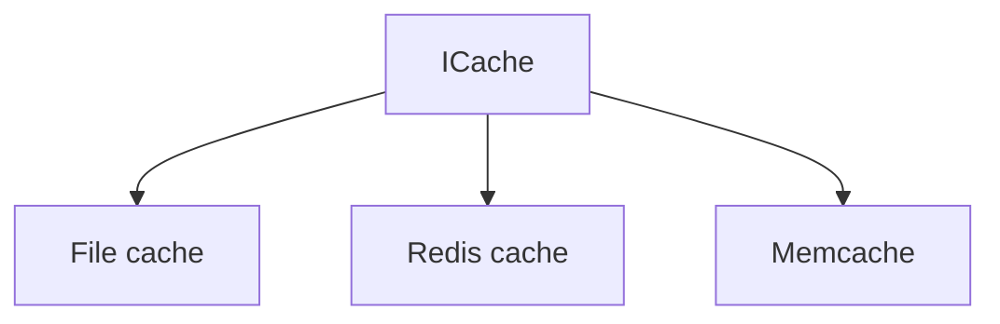

 
**Strategy Design Pattern :** 
` 
is behavior design pattern that let you define a family of algorithms, put each of them into separate class and make their objects interchangeable.
`
*****************

### From:

**Design Principle**
`identify aspects in your code what vary and sperate it from stay the same.` 

**Head First**
`take what varies and encapulate it so it w'not affect the rest of your code.`