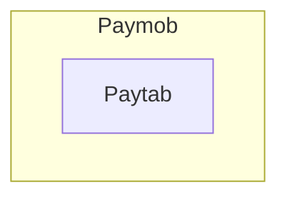

# Adapter Pattaren: 
###### Structural pattern work as bridge between two incompatible interfaces.
    converts the interface of a class
    into another interface the clients expect. Adapter lets
    classes work together that couldn’t otherwise because of
    incompatible interfaces.

_____

# Graph

-----------------------------------------
**Applicability**
* Use the Adapter class when you want to use some existing
   class, but its interface isn’t compatible with the rest of
   your code.

* Use the pattern when you want to reuse several existing sub-
   classes that lack some common functionality that can’t be
   added to the superclass.